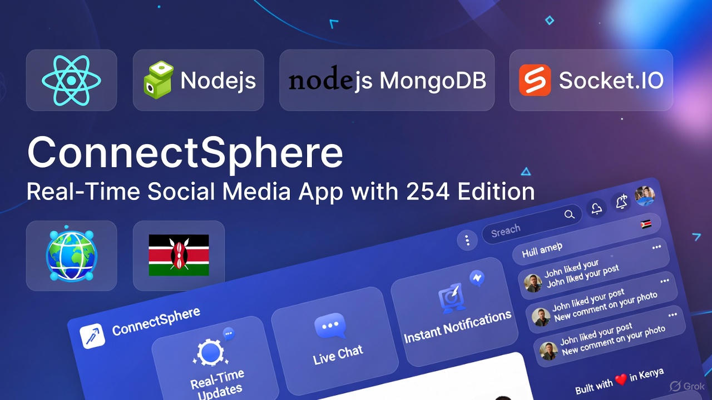
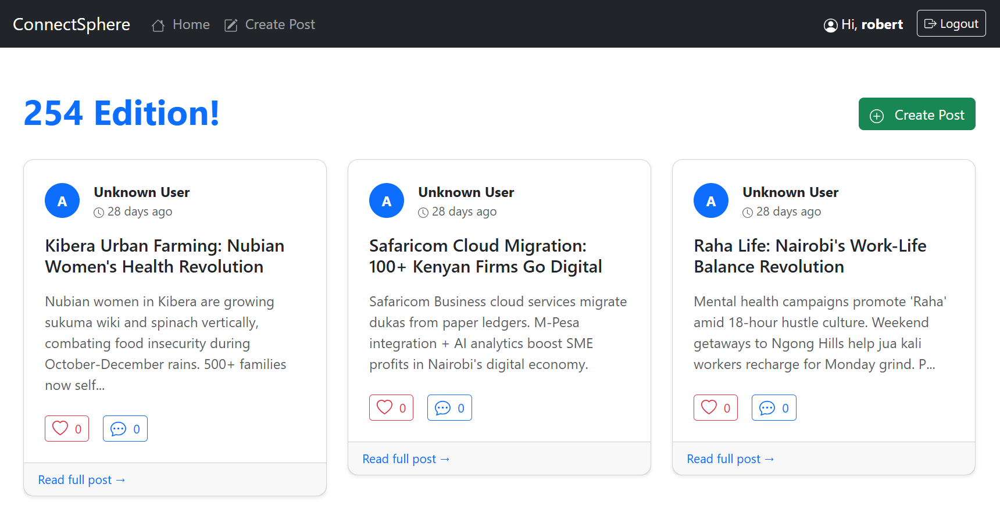
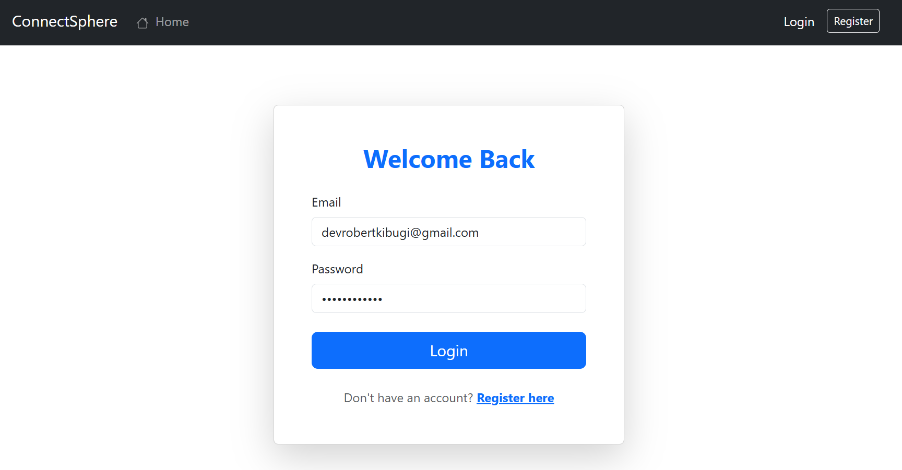
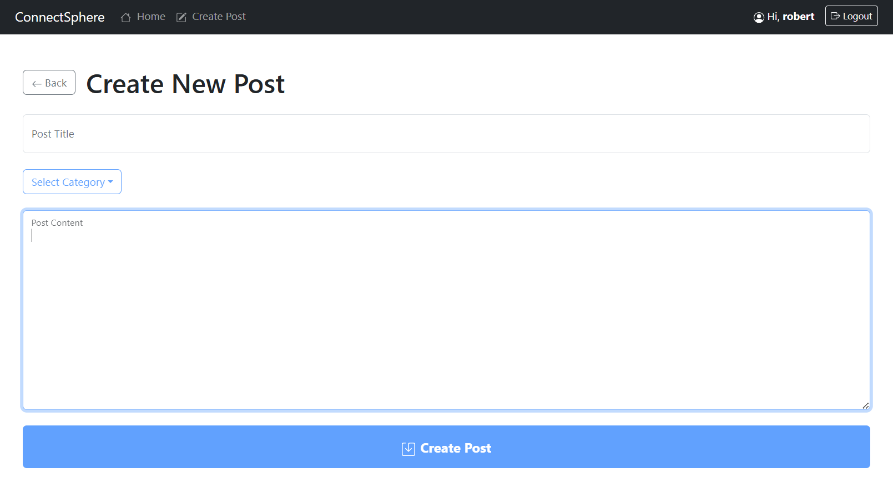
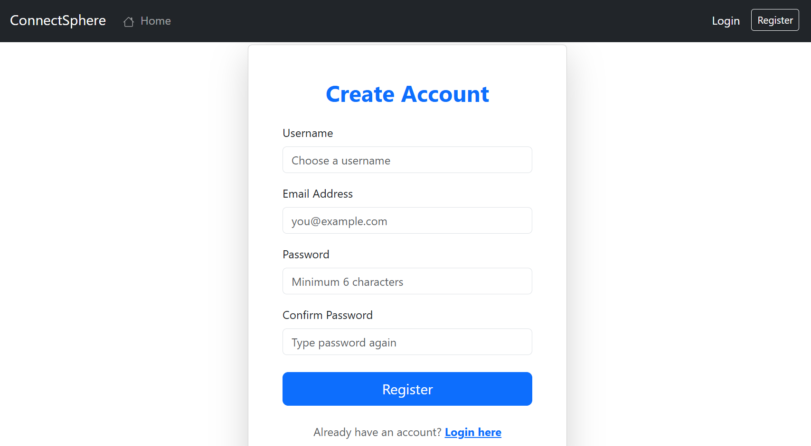

# ConnectSphere – Real-Time Social Media App (254 Edition)

**A full-stack MERN social media platform with real-time likes, comments & notifications – proudly built with Kenyan vibes!**



## Overview

ConnectSphere is a modern, real-time social media application built with the **MERN stack + Socket.IO**. Users can register, create posts with images, like posts instantly, receive live notifications, and enjoy a beautiful responsive UI – all with that authentic **254 energy**.

## Features

- Real-time likes & notifications (powered by **Socket.IO**)
- Instant toast feedback when someone likes your post
- Full user authentication (JWT + protected routes)
- Create, read, edit & delete posts with image upload
- Auto-login on page refresh
- Beautiful responsive design with **React Bootstrap**
- Pagination with smooth page transitions
- Mobile-first experience – looks fire on phone
- Owner-only edit/delete controls
- Professional dark navbar + toast notifications
- Deploy-ready (Vercel + Render compatible)

## Tech Stack

**Frontend**

- React 18+ (Vite)
- React Router v6
- React Bootstrap + react-bootstrap-icons
- Axios
- react-hot-toast
- Socket.IO Client

**Backend**

- Node.js + Express
- MongoDB + Mongoose
- JWT Authentication
- bcryptjs for password hashing
- multer for image uploads
- Socket.IO for real-time events

**Tools**

- Vite (blazing fast dev server)
- Concurrently (run frontend + backend together)

## Quick Setup

```bash
# Clone repo
git clone https://github.com/devrobintel/mern-final-project-DevRobIntel.git
cd mern-final-project-DevRobIntel

# Backend
cd server
cp .env.example .env
npm install
npm run dev

# Frontend (in another terminal)
cd ../client
npm install
npm run dev
```

## Screenshots

### Home Feed – 254 Edition!



### Login



### Create Post



### Register



Frontend: http://localhost:5173
Backend API: http://localhost:5000/api

Built with love in Kenya

Made with passion by Robert Muiruri Kibugi
PLP Final Project | November 2025
